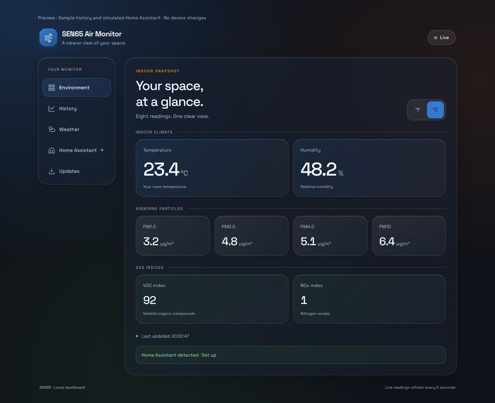
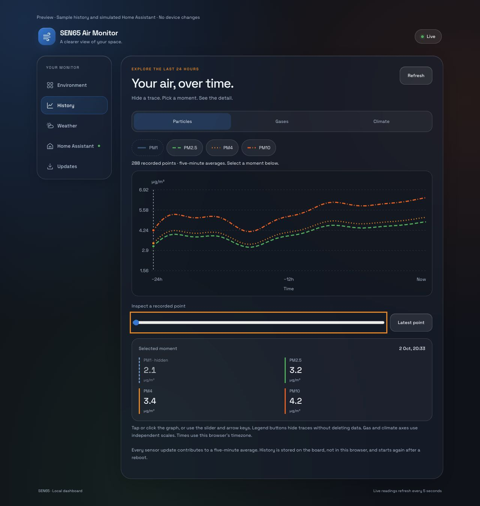
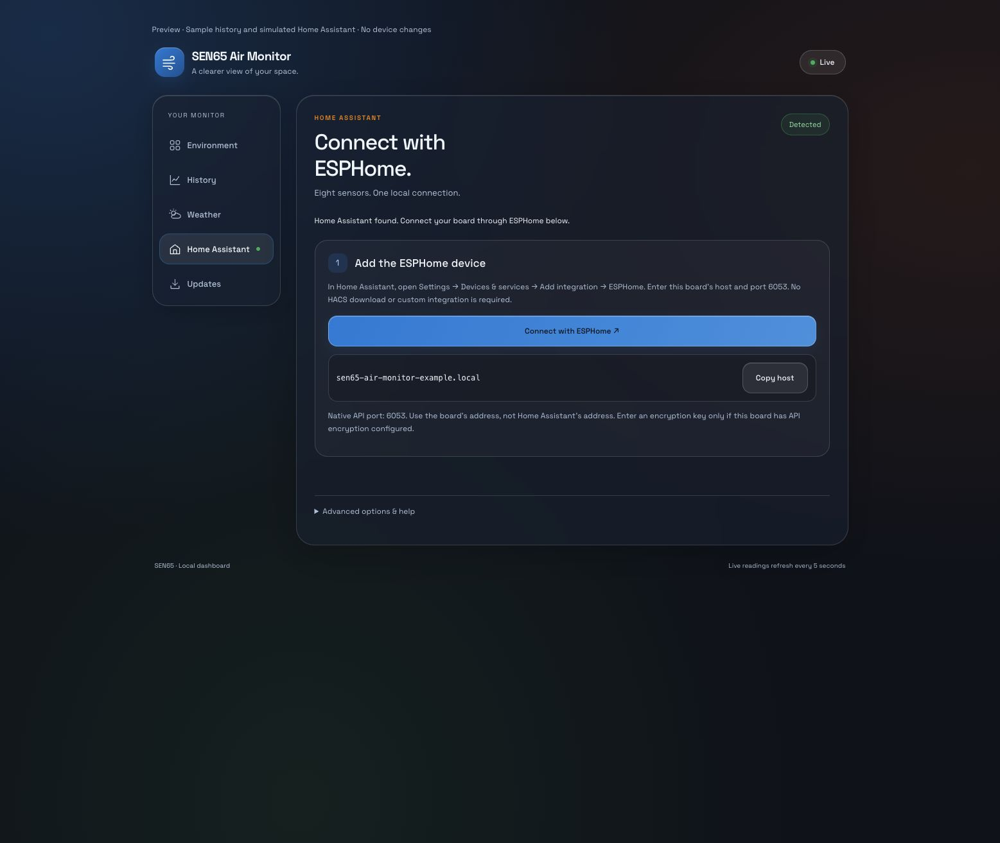
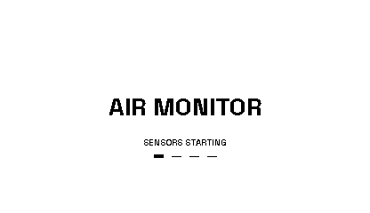
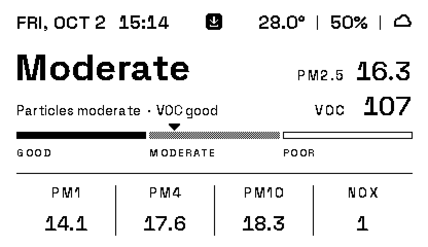

# SEN65 Air Monitor

Independent firmware project for the Aether-compatible ESP32-C3 PCB with a
Sensirion SEN65 and a Topwin TWE0370NQN35-MNG-A0 e-paper display
(also named TWE0370NQN35-A0 in the supplied specification).
The firmware renders its interface at 416×240 pixels in landscape orientation.

The firmware is maintained in this repository and does not use the upstream
Aether OTA manifest. From **v0.3.1**, the local dashboard checks this project's
GitHub manifest and can install newer releases over Wi-Fi. USB and ESPHome
OTA remain available for initial installation and recovery.

## Using your monitor

1. On an unconfigured board, join its setup Wi-Fi network and open
   `http://192.168.4.1/` to enter your Wi-Fi credentials.
2. Once connected, press BOOT to reach **Device Information**. Scan
   **DASHBOARD** to open the board's local page while on the same network.
   **INSTRUCTIONS** opens this public guide and requires internet access.
3. Use short BOOT presses to cycle through overview, particles, gases,
   climate and device information. Each graph covers up to the last 24 hours.
4. In the dashboard, choose Celsius/Fahrenheit, save a weather city, or use
   **Firmware & Updates** to check for a newer release.

Boards running **v0.3.0 or older need one initial installation of v0.3.2 or
newer via ESPHome OTA or USB** before dashboard updates can work. Publishing
new files on GitHub never installs them automatically. See the
[update and recovery guide](docs/updates.md).

## Features

The latest published OTA/factory images are **v0.3.7**, available in `dist/`.
Install the release on a board for the compact mobile menu. The native ESPHome
API is already included.
Home Assistant connects through its **built-in ESPHome integration**; no HACS
repository or custom component is required. The native API has been checked
on a board running v0.3.7; setup inside the user's HA instance remains separate.
The revised ESPHome setup page is a source change, not yet a released firmware image.

- SEN65 readings: PM1, PM2.5, PM4, PM10, temperature, humidity, VOC and NOx
- custom Space Grotesk e-paper dashboard
- date, local time and current weather icon
- weather location selectable in the dashboard: saved city or automatic IP-based location
- seven weather icons: sunny, partly cloudy, cloudy, light rain, heavy rain,
  thunderstorm and clear-night moon
- full-width 24-hour charts for particles, gases and climate; every sensor
  update contributes to a five-minute averaged history point
- three-pixel graph lines with numeric scales, units and time-axis labels (v0.3.5+)
- low-flicker e-paper animation while the sensor starts
- local web dashboard and `/api/state`
- dark glass web interface with grouped readings and responsive navigation (v0.3.3+)
- small e-paper overview indicator for an available newer firmware release (v0.3.3+)
- checksum-checked GitHub updates with HTTPS certificate verification (v0.3.1+)
- exact display capture at `/screen.pbm`
- ESPHome/Home Assistant API
- interactive web History: toggle traces and inspect recorded points (v0.3.6+)
- local Home Assistant discovery and built-in ESPHome setup guidance
- native HA sensor entities for dashboard cards, Recorder history and automations
- one-row icon-only mobile navigation (firmware v0.3.7)
- Wi-Fi onboarding through captive portal and Improv Serial/BLE

## Web dashboard

From **v0.3.3**, the local dashboard uses a dark glass design with blue, green,
amber, orange and red accents. Environment shows all eight readings grouped
into climate, particles and gas indices; Weather manages the outdoor location;
Updates checks and installs firmware from this repository.



This is a browser preview with sample data, not a capture from an installed
board. Card colors distinguish metric groups, not air-quality classifications.
Space Grotesk falls back to a system font without internet access.
See the [dashboard design and validation notes](docs/dashboard-design.md).

From **v0.3.6**, the dashboard also includes **History** and **Home Assistant**.
History uses the board's existing five-minute RAM samples, with legend toggles
and click/slider inspection. The current source guides HA setup through the
built-in ESPHome integration instead of a custom repository. Mobile navigation uses five
aligned icons with accessible names; desktop navigation retains text labels.
See [interactive history](docs/history.md) and [Home Assistant setup](docs/home-assistant.md).

### Home Assistant via ESPHome

Open **Settings → Devices & services → Add integration → ESPHome** in HA.
Enter the board's local IP/hostname and port **6053**, or confirm the discovered
ESPHome device. The existing firmware already supports this connection: no
custom integration download, HA restart or new board firmware is required.

HA receives all eight sensor entities and supports its own cards, history and
automations. ESPHome does **not** automatically copy the glass dashboard into
HA. The original web dashboard remains available at the board's local address.
Remote HA access can use its existing HTTPS/Cloudflare Tunnel connection; no
separate board HTTPS route is needed for native sensor entities.

See [ESPHome setup and migration](docs/home-assistant.md). Only the native
ESPHome connection is maintained; the custom HA dashboard integration has been
removed from the current repository.





All screenshots use sample data, not proof of a real board installation or HA
pairing. The setup preview does not create a Home Assistant connection.

For a safe sample-data preview, run `node tools/preview_dashboard.mjs` from
the repository root and open `http://127.0.0.1:8768/`. It makes no requests to
a real board or HA server. Preview query options are documented in the guides.

## Weather settings

Open the device's local dashboard and select **Weather**. Choose **Automatic
(IP-based)**, or choose **Choose a city**, search for a city or postal code,
select the matching city/country, and press **Save location**. The mode and
chosen coordinates are stored on the board and survive a restart. Each board
keeps its own location setting. Changing the weather location does not change
the clock's configured timezone.

Available from **v0.3.0**; install the firmware on a board to use these settings.
Weather refreshes every 15 minutes and after saving a location. The tab also
provides manual refresh, update age and error status. Clear nights show a moon;
cloudy and rainy nights retain their weather icon. Internet access is required.

These enlarged icons are rendered by the actual e-paper drawing functions:


See the [weather settings guide](docs/weather.md) for the dashboard preview,
complete icon mapping, local API, connectivity/security and validation notes.

## Display layouts

These previews use the firmware's original drawing functions and bitmap fonts
at the native 416×240 resolution. The overview is a device capture; graph
histories are illustrative sample data, not recorded measurements.


From **v0.3.5**, all three history pages use thicker lines and labeled axes.
Particles share a µg/m³ scale. Gases use VOC on the left and NOx on the right;
climate uses temperature on the left and humidity on the right. Temperature
follows the selected Celsius/Fahrenheit setting. Each value axis scales to its
history, so heights on different axes are not directly comparable.

The device-information page uses Space Grotesk, inset dividers and two aligned
QR blocks. Hostname and IP address remain on separate lines. Public preview
connection details are anonymized; the board shows its real addresses.



Individual display images and a local browser gallery are available in
[docs/display](docs/display/README.md).

In v0.3.3 and newer, the overview shows a small download symbol when a newer
firmware release has valid manifest metadata. Checks do not install updates
automatically. The symbol is only available after installing v0.3.3; older
boards can still find the release through their existing dashboard updater.



This indicator preview uses the firmware drawing functions and sample readings,
with the update-available flag enabled. The other display previews above are
unchanged; they do not show an available update.

## Hardware

- ESP32-C3-MINI-1, 4 MB flash
- Sensirion SEN65 on I²C: SDA GPIO10, SCL GPIO0
- Topwin TWE0370NQN35-MNG-A0 3.7-inch black-and-white e-paper display:
  MOSI GPIO7, SCK GPIO6, CS GPIO5, DC GPIO4, RST GPIO3, BUSY GPIO1
- boot button on GPIO9; short presses cycle through overview, particle,
  gas, climate and device-information pages

The currently configured display driver is `GxEPD2_370_GDEY037T03` with
rotation 1. `GDEY037T03` is the driver identifier, not the installed panel's
part number. The supplied Topwin specification confirms 240×416 native pixels
and a typical image update time of 2.8 seconds at 25°C. It does not identify
the controller or specify fast partial-refresh timing, so those aspects of
driver compatibility remain unconfirmed. See the
[Topwin display specification notes](docs/topwin-display.md) for details.

## Build

Python 3.11+ is recommended.

```bash
python3 -m venv .venv
.venv/bin/pip install esphome==2026.8.2 pillow
.venv/bin/esphome config firmware/sen65-air-monitor.yaml
.venv/bin/esphome compile firmware/sen65-air-monitor.yaml
```

The build produces:

- `/tmp/sen65-air-monitor-build/.pioenvs/sen65-air-monitor/firmware.factory.bin`
- `/tmp/sen65-air-monitor-build/.pioenvs/sen65-air-monitor/firmware.ota.bin`

Set `AIR_MONITOR_BUILD_PATH` to use a different build directory.

Verified release binaries are also stored in `dist/`, together with SHA-256
checksums. Use the `factory` image at address `0x0` for a clean installation;
use the `ota` image only for an existing compatible installation.

The chart history is kept in RAM to avoid unnecessary flash wear. It starts
again after a reboot and reaches the full 24-hour window after 288 samples.

## Install

First installation or recovery over USB:

```bash
.venv/bin/esptool --chip esp32c3 --port /dev/cu.usbmodemXXXX erase-flash
.venv/bin/esptool --chip esp32c3 --port /dev/cu.usbmodemXXXX \
  write-flash 0x0 firmware.factory.bin
```

Update a configured device over Wi-Fi:

```bash
.venv/bin/esphome upload firmware/sen65-air-monitor.yaml \
  --device sen65-air-monitor-XXXXXX.local
```

For dashboard updates and release packaging, see [docs/updates.md](docs/updates.md).

## Fonts

Generated Space Grotesk GFX headers live under
`firmware/components/air_monitor_epaper/fonts/`. Regenerate them with:

```bash
.venv/bin/python tools/gen_gfx_fonts.py \
  firmware/components/air_monitor_epaper/fonts
```

## Origin and license

This is adapted from Enrique Neyra's Aether project. See [NOTICE.md](NOTICE.md)
for attribution and a summary of the changes. The adapted project remains
licensed under CC BY-NC-SA 4.0; commercial use is not granted. See [LICENSE](LICENSE).

Space Grotesk is licensed separately under the SIL Open Font License; see
`assets/fonts/OFL-Space-Grotesk.txt`.
