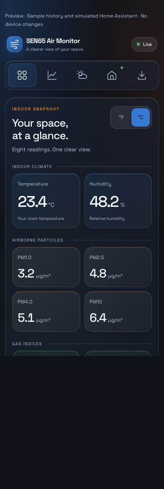

# Dark glass dashboard — firmware v0.3.7 and current source

The dark glass design was introduced in v0.3.3. These current screenshots
include the History inspector and built-in ESPHome setup guidance. The revised
setup page is not yet part of a released firmware image. They use sample
readings and simulated controls, not an installed board. Publishing a release
does not install it on a device; these additions have not been verified on hardware.

### Mobile

The mobile menu omits visual labels but keeps accessible button names. All five
56-pixel targets remain on one row without overlap or horizontal overflow.

### Weather

Berlin and the weather conditions are fixture data, not the owner's location
or live weather. See the [weather guide](weather.md) for real-device settings.

### Updates

Firmware versions and update status in this preview are simulated; it is not
proof of a physical-board installation. See the [update guide](updates.md).

### History

The selected point and hidden trace are fixture data. Colors, dash patterns,
click selection and keyboard/slider inspection help separate overlapping traces.
The real page reads the board's existing RAM history. See [History](history.md).

### Home Assistant

“Detected” is simulated in this screenshot. It is not proof of a real discovery,
integration or an HA dashboard. See [Home Assistant via ESPHome](home-assistant.md)
for native sensor pairing, history and safe migration. No HACS installation is
required. ESPHome does not automatically copy the glass dashboard into HA.

Only native ESPHome pairing is provided. There is no dashboard linking or
custom HA panel in the current project.

## Visual direction

- Dark neutral background (`#0B111B`) with soft blue, green and orange glows.
- Translucent glass panels, subtle borders and rounded corners.
- Palette: red `#C31725`, blue `#2585D9`, green `#51B666`, amber `#F28F16`,
  orange `#F26513`.
- Blue leads navigation and actions; green marks live status and gas-card
  accents; orange marks particle-card accents; amber highlights weather and
  available updates. Red marks errors, with a lighter red text tint for contrast.
  Card accent colors identify groups, not air-quality classifications.
- Space Grotesk with a system-font fallback when Google Fonts is unavailable.
- Light text and controlled color accents; English labels throughout.
- Readings grouped into indoor climate, airborne particles and gas indices.
- Desktop text navigation; five equal, icon-only mobile targets (56 pixels high),
  with accessible names and no wrapping/overlap. Temperature controls are at
  least 44 pixels high.
- Visible keyboard focus, reduced-motion support and an opaque fallback for
  browsers without background blur.

## E-paper update indicator

A small download symbol appears on the overview only when the configured
firmware updater reports a newer release with an approved download URL and
valid checksum metadata, without a reported error. This validates the manifest
metadata; the image itself is checksum-verified during installation.

The symbol uses an available header gap, or a reserved position below the
header when the date and climate values leave insufficient room. It is cleared
on the next normal redraw when no verified update remains available. It does
not install an update automatically or flash an animation.

## Validation

Published firmware images were built with the pinned ESPHome toolchain.
Current source changes are checked separately and do not replace immutable
release binaries. Browser checks cover the ESPHome connection page, discovery,
offline states and narrow layouts. Screenshots contain sample data, not proof
of HA pairing. Hardware installation remains a separate step.
