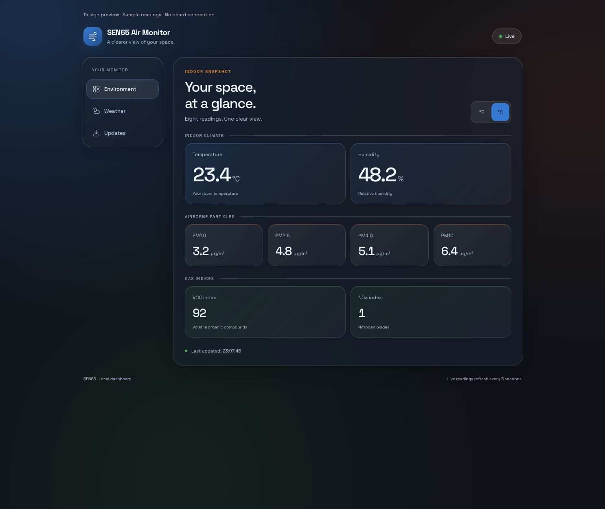
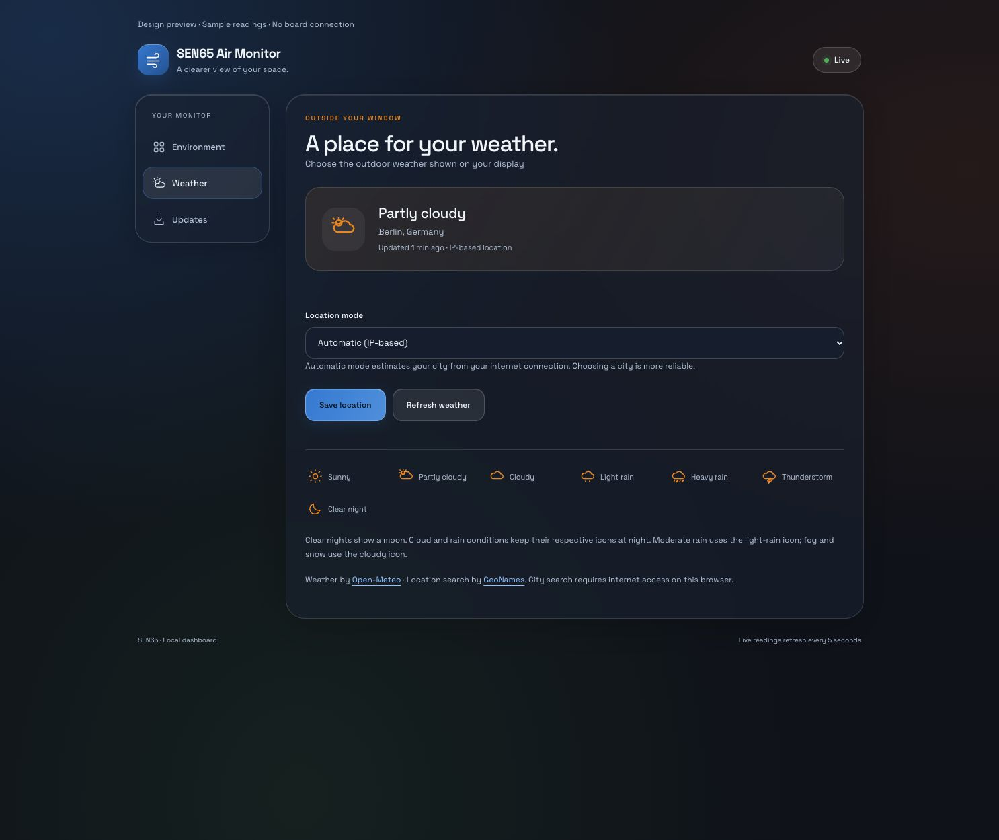
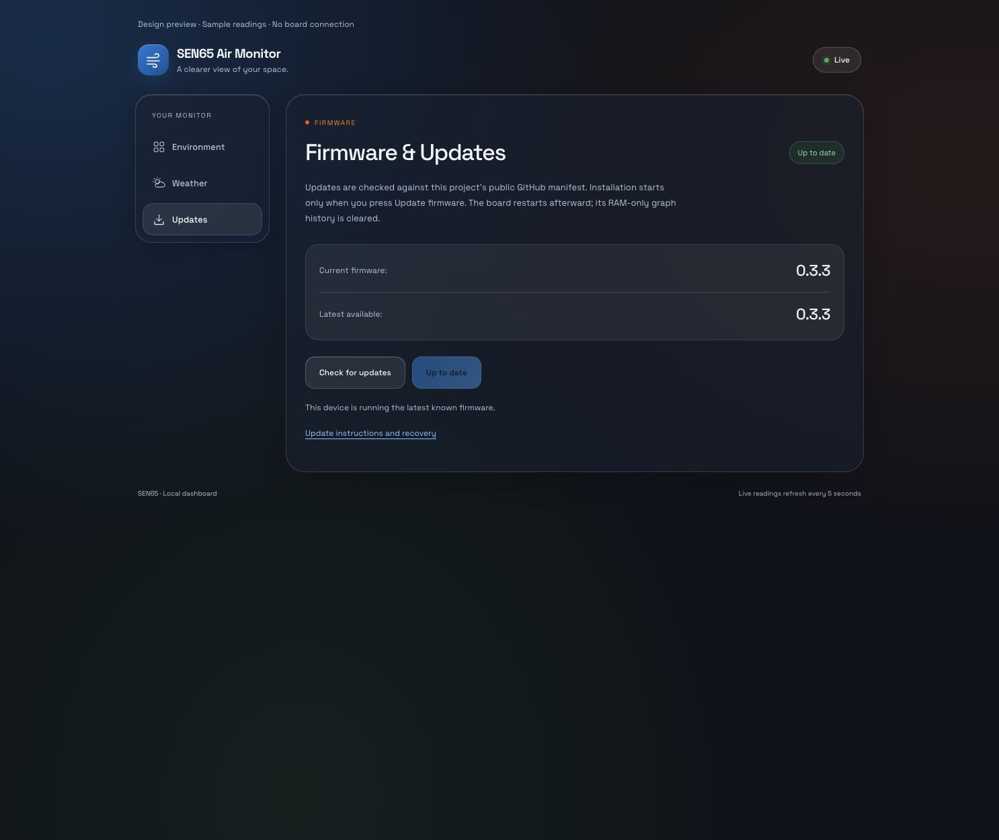

# Dark glass dashboard — v0.3.3

This design is included in the v0.3.3 firmware. The preview uses sample readings
and simulated controls, not an installed board. Publishing a release does not
install it on a device; this release has not yet been verified on hardware.

### Weather

Berlin and the weather conditions are fixture data, not the owner's location
or live weather. See the [weather guide](weather.md) for real-device settings.

### Updates

Firmware versions and update status in this preview are simulated; it is not
proof of a physical-board installation. See the [update guide](updates.md).

## Visual direction

- Dark neutral background (`#0B111B`) with soft blue, green and orange glows.
- Translucent glass panels, subtle borders and rounded corners.
- Palette: red `#C31725`, blue `#2585D9`, green `#51B666`, amber `#F28F16`,
  orange `#F26513`.
- Blue leads navigation and actions; green marks live status and gas-card
  accents; orange marks particle-card accents; amber highlights weather and
  available updates. Red marks errors, with a lighter red text tint for contrast.
  Card accent colors identify groups, not air-quality classifications.
- Space Grotesk with a system-font fallback when Google Fonts is unavailable.
- Light text and controlled color accents; English labels throughout.
- Readings grouped into indoor climate, airborne particles and gas indices.
- Responsive navigation and 44-pixel minimum temperature controls.
- Visible keyboard focus, reduced-motion support and an opaque fallback for
  browsers without background blur.

## E-paper update indicator

A small download symbol appears on the overview only when the configured
firmware updater reports a newer release with an approved download URL and
valid checksum metadata, without a reported error. This validates the manifest
metadata; the image itself is checksum-verified during installation.

The symbol uses an available header gap, or a reserved position below the
header when the date and climate values leave insufficient room. It is cleared
on the next normal redraw when no verified update remains available. It does
not install an update automatically or flash an animation.

## Validation

The firmware compiles with the pinned ESPHome toolchain. Browser checks cover
Environment, Weather and Updates at narrow mobile widths, including horizontal
overflow and temperature-control target sizes. Native display renders compare
the overview with and without the indicator using the firmware's actual GFX
fonts. Release packaging checks the OTA partition size, manifest and image
checksums. Hardware installation and physical e-paper readability checks remain
separate steps; no board was updated as part of this publication.
