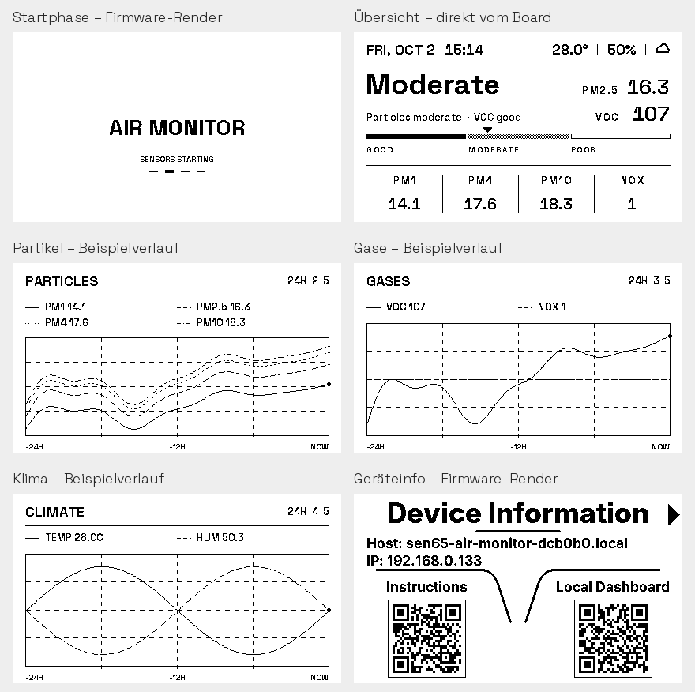

# Display previews

Native resolution: 416×240 pixels. Images are produced with the original
firmware layout functions and the same Adafruit GFX bitmap fonts used by
the e-paper display, without a separately drawn mockup.

Open `index.html` locally to view the gallery. This is a static preview;
it does not connect to the device or change its settings.

| Page | Image |
| --- | --- |
| Startup | [boot.png](boot.png), [boot-animation.gif](boot-animation.gif) |
| Overview | [overview.png](overview.png) |
| Particles | [particles.png](particles.png) |
| Gases | [gases.png](gases.png) |
| Climate | [climate.png](climate.png) |
| Device information | [info.png](info.png) |

The overview is a capture from a running device. The history pages use
synthetic values to show a complete 24-hour curve. Their geometry and fonts
come directly from the firmware. The device-information preview uses example
local addresses. The startup GIF shows the four animation frames at the
configured 900 ms interval; actual hardware refresh duration can vary.

