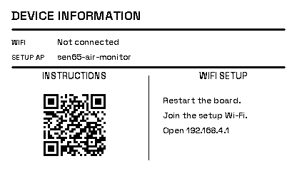
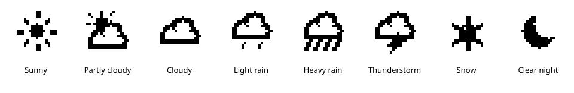

# Display previews

Native resolution: 416×240 pixels. Images are produced with the original
firmware layout functions and the same Adafruit GFX bitmap fonts used by
the e-paper display, without a separately drawn mockup.

The project's display is Topwin TWE0370NQN35-MNG-A0, also named
TWE0370NQN35-A0 in the supplied specification. Its native 240×416 pixels
match the configured 416×240 landscape rendering. These previews do not
establish controller or refresh compatibility; see the
[display specification notes](../topwin-display.md).

Open `index.html` locally to view the gallery. This is a static preview;
it does not connect to the device or change its settings.

| Page | Image |
| --- | --- |
| Startup | [boot.png](boot.png), [boot-animation.gif](boot-animation.gif) |
| Overview | [overview.png](overview.png) |
| Particles | [particles.png](particles.png) |
| Gases | [gases.png](gases.png) |
| Climate | [climate.png](climate.png) |
| Device information | [info.png](info.png) |
| Device information, offline | [info-offline.png](info-offline.png) |
| Weather symbols | [weather-icons.svg](weather-icons.svg) |

The overview is a capture from a running device. The history pages use
synthetic values to show a complete 24-hour curve. Their geometry and fonts
come directly from the firmware. In the public device-information preview,
the IP address is masked, the hostname has no device-specific suffix, and
the dashboard QR code uses an example hostname instead of the device's IP.
The device itself still displays its real connection details.

## History graphs (v0.3.5)

All three graphs use three-pixel strokes with matching legend samples.
Their horizontal axis is **TIME**, labeled **-24H**, **-12H** and **NOW**.
Numeric value axes adjust to the available history:

- **Particles:** PM1, PM2.5, PM4 and PM10 share the left-hand **µg/m³** scale.
- **Gases:** **VOC INDEX** on the left and **NOX INDEX** on the right.
- **Climate:** **TEMP °C** or **TEMP °F** on the left and **HUM %** on the right.

Gas and climate series use independent scales; equal heights do not imply
equal values. Exact overlaps can still hide another trace even with thicker
lines. Sampling remains unchanged: every sensor update contributes to a
five-minute averaged point. The history is held in RAM and resets on reboot.
The graph previews show sample data, not a capture from the installed board.

## Device information and startup

From v0.3.1, both connected and offline Device Information use Space Grotesk
with a 16-pixel outer inset, separate metadata rows and inset divider lines.
The connected QR blocks are centered in equal columns; their white margins
contain at least four QR modules. **INSTRUCTIONS** opens this project's public
README. **DASHBOARD** opens the board's current local address and requires the
same LAN. The offline page instead shows setup Wi-Fi instructions.
These are native firmware renders, not a separately designed approximation.
The startup GIF shows the four animation frames at the
configured 900 ms interval; actual hardware refresh duration can vary.

## Weather icons (current source)

The display supports sunny, partly cloudy, cloudy, light rain, heavy rain,
thunderstorm, snow, and a crescent moon for clear nights. This enlarged strip is
rendered with the actual firmware icon functions; the icons occupy an
18×18-pixel area on the device. Rain and thunderstorm icons remain visible
at night rather than being replaced by a moon. Snow has its own snowflake;
fog retains the cloud fallback. Snow is an unreleased source addition and
requires a future firmware release or local build.

Choose **Weather** in the device dashboard to search for and save a city, or
retain automatic IP-based location. See the [weather settings guide](../weather.md).
