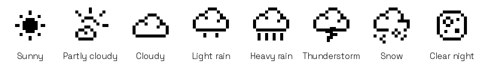

# E-paper pixel weather icons

These icons are included in firmware v1.0.1. Publication does not install them
on a board; they have not been verified on physical hardware during this
release. The display keeps its Space Grotesk fonts.



The e-paper renderer uses the approved web SVG shapes as 24 x 24 one-bit
bitmaps. All eight kinds preserve the existing weather mapping. The header
reserves the full 24-pixel width. Only 576 bitmap bytes are required, without
SVG decoding or network access on the board.

Regenerate with Pillow, resvg-py and Node.js installed:

```bash
python tools/gen_weather_bitmaps.py
```

The firmware compiles with ESPHome 2026.8.2. All eight native GFX icon renders
have been checked pixel-for-pixel against the generated bitmaps. The gallery
uses sample weather, not a live device capture. No font changes are included.
