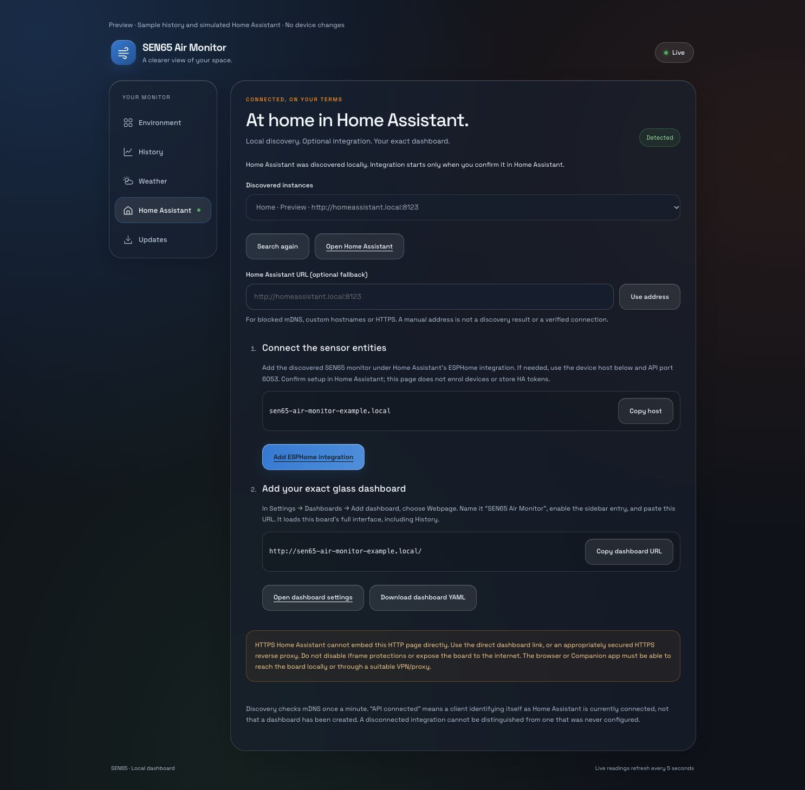

# Home Assistant: discovery and exact dashboard

Available from **v0.3.6**. No automatic enrolment occurs.
The board's existing ESPHome API provides sensor entities; the new dashboard
tab reports discovery and guides optional setup. This feature requires a
matching firmware build on the board; v0.3.5 and earlier do not include it.

This is a browser fixture, not a real HA pairing or board-discovery result.

## Detection is not pairing

When Wi-Fi is connected, the board queries `_home-assistant._tcp.local.` via
mDNS once a minute. A three-second asynchronous search does not block the
sensor/display loop. **Search again** requests another search, subject to a
ten-second cooldown. Up to four IPv4 instances are listed. A discovery notice
also appears on Environment and in navigation.

- **Detected**: a Home Assistant mDNS advertisement was found. This does not
  mean that the monitor was added to HA or that its URL is reachable.
- **API connected**: a current, setup-complete ESPHome API client identifies
  itself as Home Assistant. This is a connection indicator, not authentication
  proof, a configuration registry check, or proof that a dashboard exists.
- **Not found**: no advertisement was found. HA can still exist on this network.
- **Wi-Fi disconnected / Unavailable**: discovery cannot currently be used.

HA must advertise Zeroconf and multicast must reach the board. VLAN isolation,
guest Wi-Fi and some container/network configurations can prevent detection
even on the same routed network. The current detector requires IPv4; IPv6-only
instances are not listed. **Home Assistant URL** offers an optional, browser-only
manual fallback. It is neither verified nor reported as automatic detection.

Advertisements are untrusted. Only HTTP(S) links matching the discovered IPv4
address or exact advertised `.local` hostname/port are used automatically.
Custom `internal_url` aliases, external URLs or reverse-proxy ports may therefore
require the manual URL field. No advertised URL is fetched by the board.
The manual field accepts HTTP(S) without embedded credentials and keeps only
the origin. It is not saved on the board and clears when the page reloads.

## 1. Add the sensor entities (optional)

1. Open **Home Assistant** in the device dashboard.
2. Use **Copy host** and **Add ESPHome integration**, or go to HA's
   **Settings → Devices & services** and select the discovered ESPHome device.
3. Confirm the ESPHome configuration in HA. If asked, enter the monitor's host
   (or its LAN IP) and API port **6053**. An installation with API encryption
   must also provide its existing encryption key in HA.

The button opens the official My Home Assistant setup redirect. If that
redirect is not configured for your instance, use HA's settings directly.
No HA tokens are requested or stored in the monitor, and this page does not
call HA's configuration API or silently create an integration. Reuse an
existing integration instead of adding a duplicate. This firmware currently
uses the existing, unencrypted native API configuration; keep it on a trusted
LAN/VPN. This update does not weaken or remove any security setting.

## 2. Add the exact web interface as its own HA dashboard

1. Copy **dashboard URL** from the monitor's Home Assistant tab.
2. In HA choose **Settings → Dashboards → Add dashboard → Webpage**.
3. Enter **SEN65 Air Monitor**, enable its sidebar entry, and paste the URL.
4. Save and open the new dashboard.

The page is embedded directly from the board. It retains the exact dark glass
design, all tabs, interactive History and the board's existing controls. It is
not a reproduction using native HA cards. Sensor integration and embedding
are independent: an embedded page alone does not create sensor entities.

For manual configuration, **Download dashboard YAML** provides an iframe view
for a **new, dedicated** dashboard. A sanitized template is in
[home_assistant/dashboard.yaml](../home_assistant/dashboard.yaml). Replace the
example host with the actual board URL. Do not paste it over an existing
dashboard's configuration. If a browser blocks the download, use this template.
`panel_iframe` is not used; use the current Webpage dashboard or iframe card.

### HTTPS and remote access

An HTTPS HA page **cannot embed the board's HTTP page directly**: the browser
blocks mixed content. Use the direct board URL separately, or configure an
appropriately secured HTTPS reverse proxy and use that HTTPS URL for the
embedded dashboard. Do not disable iframe protections, bypass certificate
warnings or expose the bare board/API to the Internet.

Embedding does not proxy network traffic through HA. The browser or Companion
app must resolve and reach the board URL. Remote HA access alone does not grant
remote access to the board; use a suitable VPN or secure proxy. `.local` name
resolution also varies by client, so a reserved LAN IP may work better locally.
Changing the board's DHCP address requires updating an IP-based embed URL.

## Local status API

`GET /api/home_assistant` reports `network_connected`, `scanning`, `checked`,
`api_connected`, `error`, `instances` (`name`, safe `url`), `device_host`,
`device_url` and `api_port`. It contains no HA credentials.
`POST /api/home_assistant/scan` queues discovery with HTTP 200, or returns 409
when offline, busy or within the cooldown. It does not pair any device.

## Validation and limitations

The firmware builds for ESP32-C3. Pure helper tests cover safe advertised URLs,
client-name classification, history serialization and web assets. Browser
fixtures exercise detected/connected/not-found states, legend controls, point
selection and responsive navigation without changing a real HA server.
`?ha=connected` and `?ha=none` select those preview states.

Real-board discovery, pairing and iframe operation in the user's HA instance
still require an installed test build and user-confirmed HA setup. A computer
finding HA's mDNS advertisement is not proof that the board can see it.

Official references: [HA Zeroconf](https://www.home-assistant.io/integrations/zeroconf/),
[ESPHome integration](https://www.home-assistant.io/integrations/esphome/),
[Webpage dashboards](https://www.home-assistant.io/dashboards/dashboards/) and
[iframe card and HTTPS restriction](https://www.home-assistant.io/dashboards/iframe/).
