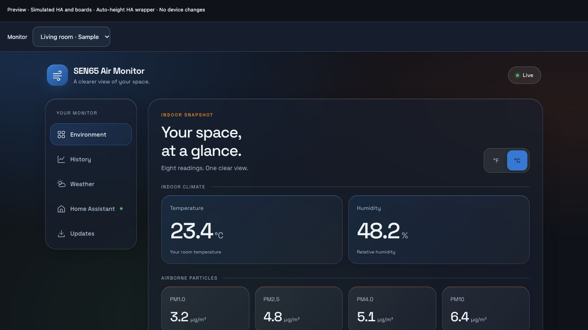
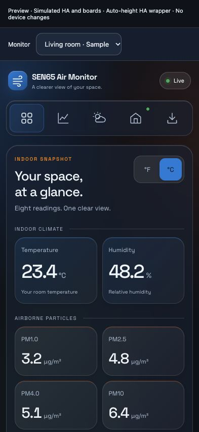

# Home Assistant: the exact dashboard, without a separate HTTPS address

The custom **SEN65 Air Monitor** integration serves the same dashboard through
Home Assistant. After adding a board, an **SEN65 Air Monitor** sidebar panel is
registered automatically. It includes Environment, interactive 24-hour History,
Weather and Firmware & Updates. Multiple boards share one panel with a selector.

```text
Browser / Companion app → HA login + HTTPS/WebSocket → HA backend → LAN board
```

No board subdomain, Cloudflare route, certificate, mixed-content exception or
Webpage dashboard configuration is needed. Remote access uses the existing HA
connection; HA, not the remote browser, must be able to reach the board.

## Status and requirements

- Integration version: **0.1.2, panel-height fix**. Available from this
  repository, but not included in the default HACS catalogue.
- Tested API compatibility: **Home Assistant 2026.9.4**, Python 3.14. Earlier
  HA versions are not currently declared supported.
- Board firmware **v0.3.6 or later**, with `/api/state`, `/api/history`,
  `/api/weather` and `/api/home_assistant`.
- An HA administrator account. The first version deliberately restricts both
  panel access and every backend command to administrators, because the shared
  interface can change settings and install firmware.
- HA can reach the configured board on its private LAN. IPv4 RFC1918 addresses
  and IPv6 ULA addresses are accepted; loopback, public and link-local targets
  are rejected. Hostnames must resolve exclusively to accepted LAN addresses.

This is a dashboard integration, not a replacement for native ESPHome sensor
entities. Keep or add the ordinary ESPHome integration for automations and HA
Recorder history. The shared graph still displays the board's RAM-only history;
it resets after reboot and uses five-minute averages of sensor updates.

The shared dashboard is adapted from Aether by Enrique Neyra / Syntropy Labs.
The project remains under **CC BY-NC-SA 4.0**, including NonCommercial and
ShareAlike conditions; public availability does not grant commercial use.
See [attribution and changes](../NOTICE.md) and the [license](../LICENSE).

## Installation

### Updating from v0.1.1: clipped dashboard fix

The public v0.1.1 panel can collapse to a 150-pixel iframe in HA's auto-height
custom-panel wrapper, leaving most of the screen blank. v0.1.2 fixes that sizing
bug by measuring the available viewport and allocating it to the dashboard.
This update changes
only the HA integration, not board firmware.

In HACS, open the SEN65 Air Monitor repository, check for the latest release
and download **ha-v0.1.2**. If HACS has not refreshed its release list yet,
refresh the repository information before downloading. Then restart HA and
fully reload the HA browser page (or reopen the Companion app) so its new
panel module is loaded. Keep existing SEN65 and ESPHome entries.

For manual installation, download the [v0.1.2 ZIP](../dist/home-assistant/sen65-air-monitor-ha-v0.1.2.zip),
back up the current component and replace only
`/config/custom_components/sen65_air_monitor` with the folder from the v0.1.2
package. Restart HA and fully reload the HA browser page to load the new panel
module. Keep existing SEN65 and ESPHome entries. No board restart or graph-history
reset is needed. Confirm that the panel fills the visible screen and remains
usable after resizing and selecting History; roll back to the backed-up component
and restart HA if the update fails.

### Manual installation

1. Copy **only** `custom_components/sen65_air_monitor` into your HA configuration
   directory's `custom_components` folder. The resulting path must be
   `/config/custom_components/sen65_air_monitor/manifest.json` on HA OS.
   For HA Container, use its mounted configuration directory.
2. Restart Home Assistant.
3. Select **Settings → Devices & services → Add integration → SEN65 Air Monitor**.
4. Enter the board's local address (for example `sen65-air-monitor-example.local`)
   and a room name. Confirm setup.
5. Open **SEN65 Air Monitor** in the HA sidebar. No second dashboard-creation step
   is needed. Add another integration entry for each additional board.

For a packaged install, download the [v0.1.2 installation ZIP](../dist/home-assistant/sen65-air-monitor-ha-v0.1.2.zip)
and extract it into the HA
configuration directory; it already contains the `custom_components` structure.
Back up an existing installation first. Do not extract the entire project or
replace other custom integrations. Removing this integration entry removes the
panel when the last board is removed; it does not reset the board or ESPHome.

### HACS custom repository

The repository contains one integration and a `hacs.json` for custom-repository
installation. Add
`https://github.com/LeMec87/sen65-air-monitor` to HACS as an **Integration** custom
repository, download it, restart HA, then follow steps 3–5 above. This is not a
claim of HACS catalogue inclusion or an official HA built-in integration.

## Discovery, offline boards and address changes

The integration can offer an mDNS-discovered `sen65-air-monitor*` ESPHome device
for confirmation after the integration has been installed. Discovery does not
silently add a device or redirect an existing entry. Manual address entry works
when multicast is blocked. Discovered native API port 6053 is not used for the
dashboard; its HTTP endpoint is on port 80.

Setup checks the expected API and uses the board's reported `.local` host as its
stable identity. A renamed board may need to be removed and added again. After
a DHCP address change, use the integration entry's **Reconfigure** action and
enter the new address of the same board. A DHCP reservation is recommended.

Offline boards retry during HA setup. A board that goes offline later remains
in the selector and its dashboard reports Offline; readings are not invented.
Use the panel's retry button if no configured board is available after startup.

## Security and transport

Only the shared frontend's static code is publicly served by HA. It contains no
board data, private addresses or tokens. Data/control commands use HA's existing
authenticated WebSocket connection and enforce administrator access server-side.
No long-lived access token is requested, stored or passed into the dashboard.

The frame bridge validates origin, source window, entry and a per-frame session
identifier. Switching boards drops stale replies. The backend accepts only
configured entry IDs and a fixed allowlist of API methods, paths and parameters.
It is not a generic URL proxy. Hostnames are resolved and validated for every
uncached request, requests are pinned to a private IP, redirects are rejected,
JSON responses are size-limited, and timeouts bound network operations.

The LAN connection to the existing board is normally HTTP; the browser-to-HA
connection retains whatever HTTPS/authentication HA already uses. This does not
add authentication to the board's standalone LAN server. Keep that server and
the native ESPHome API on a trusted LAN/VPN and never publish them directly.
The city-search feature continues to contact Open-Meteo from the browser over
HTTPS, as it does in the standalone dashboard.

## Shared assets, packaging and validation

### Local visual preview

The following fixture runs the actual panel and shared frontend with simulated
HA commands and sample boards, not a real HA installation:

It deliberately uses an auto-height wrapper, with no externally forced panel
height. This reproduces HA's percentage-height failure and prevents the fixture
from hiding it again. The panel itself must fill the remaining viewport.

```sh
node tools/preview_dashboard.mjs 8768
# In a second terminal:
node tools/preview_ha_panel.mjs 8769
```

Open `http://127.0.0.1:8769/`. The room selector, history inspector and mobile
icon-only navigation can be tested without contacting or changing a real board.



Sample data only. This fixture does not reproduce HA login or its outer sidebar;
those still require validation in a real HA installation.



### Build the installable package

The board's web files are the source of truth. Before packaging either version:

```sh
python3 tools/sync_ha_frontend.py
python3 tools/sync_ha_frontend.py --check
python3 tools/package_ha_integration.py
```

HA assets are included inside the integration so installation does not depend
on an external checkout or runtime download. Packaging is deterministic, excludes
Python caches and refuses to replace a different package under an existing
version. Bump the HA manifest version before publishing changed package bytes.
HA integration updates and board firmware updates are separate operations.

Tests cover real HA registration/config-flow/WebSocket APIs, access restrictions,
board identity, request allowlists, LAN resolution, redirects, payload limits,
cache invalidation, frontend transport and shared-asset consistency. Tests use
mocked LAN responses; installing and testing in a user's real HA instance is
still a separate user-authorized step, not an outcome claimed by these tests.

## Standalone dashboard and legacy embedding

The board dashboard still discovers HA with mDNS and guides installation. Native
ESPHome connectivity is not proof that the custom dashboard integration is
installed. In HA panel mode the setup instructions are replaced by an installed
panel notice; no further HTTPS setup is suggested.

The older Webpage/iframe method remains optional under Advanced options.
Unlike the integration, it still needs an HTTPS board/proxy address if HA is
opened through HTTPS. Its YAML is only for a new dedicated dashboard, never a
replacement for existing configuration.

Official references: [custom HA panels](https://developers.home-assistant.io/docs/frontend/custom-ui/creating-custom-panels/),
[WebSocket extensions](https://developers.home-assistant.io/docs/frontend/extending/websocket-api/),
[configuration flows](https://developers.home-assistant.io/docs/core/integration/config_flow/),
[HACS integration structure](https://www.hacs.dev/docs/publish/integration/) and
[legacy iframe HTTPS restriction](https://www.home-assistant.io/dashboards/iframe/).
