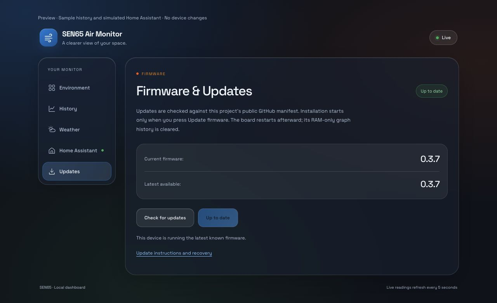

# Firmware updates and recovery

Dashboard updates are supported from **v0.3.1**, with corrected request statuses
in **v0.3.2**. Boards running v0.3.0 or older have no GitHub updater: install
v0.3.2 or newer once via ESPHome OTA or USB.
Uploading a release to GitHub does not upgrade a board by itself.

## Check and install

1. Connect the board to Wi-Fi with internet access. Open its local dashboard.
2. Select **Updates** (**Firmware & Updates** on older dashboards), then
   **Check for updates**.
3. When a newer version is available, press **Update to …** to install it.
4. Keep power connected throughout installation. The board restarts when done;
   reload the dashboard and confirm the current version.

The firmware also checks shortly after startup (initially after 10 seconds,
with network retries) and every six hours. Checks never install automatically.
Wi-Fi and saved weather settings are retained by a normal OTA update; the
RAM-only graph history starts over after the restart. Do not use factory reset
or erase-flash for a routine update.

From **v0.3.3**, an available newer release is also indicated by a small download
symbol on the e-paper overview. The symbol requires a successful check with
valid manifest metadata and clears on a normal redraw when no valid update
remains available. It does not trigger installation. Boards on v0.3.2 can find
and install v0.3.3 through the existing dashboard without this symbol.

The board reads this project's [manifest](../dist/manifest.json) over HTTPS
from GitHub's raw-file host. The manifest identifies an ESP32-C3 OTA image,
release version and MD5 checksum. HTTPS server certificates are verified; MD5
checks transfer integrity, **not** a separate cryptographic publisher signature.
The dashboard only accepts a numerically newer `major.minor.patch` release,
a version-matching OTA path in this repository, and valid checksum metadata.
SHA-256 checksums for manual verification are in [SHA256SUMS](../dist/SHA256SUMS).
The Home Assistant update entity is also available; dashboard-specific
version and URL guards apply to the local dashboard API.

## Problems

- **Initial update required:** use ESPHome OTA or USB once. An old dashboard
  may instead show an unknown version or a check that never finds an update.
- **Update error / timeout:** verify internet access, then check again.
  Invalid metadata or failed manifest requests disable installation.
- **v0.3.1 rejects the check despite fetching a version:** that release returns
  an incorrect HTTP error after accepting a queued check or install. Wait for
  the next dashboard poll; when v0.3.2 is offered, install it. An installation
  may briefly report an error before progress appears. ESPHome OTA is also
  available to skip this old response-status issue.
- **Up to date:** no numerically newer release was found; equal or older
  manifest versions cannot be installed from the dashboard.
- **Page disconnects during installation:** wait for the board to restart,
  reopen its local address and check the displayed firmware version.
- **Board cannot start or join Wi-Fi:** use USB recovery below. Recovery that
  erases flash removes saved settings.

## One-time bootstrap or manual OTA

Follow the [build instructions](../README.md#build), then update over Wi-Fi:

```bash
.venv/bin/esphome upload firmware/sen65-air-monitor.yaml \
  --device sen65-air-monitor-XXXXXX.local
```

Replace the example hostname with the hostname shown on your board. USB
recovery uses the release's `factory` image at address `0x0` (not its OTA image):

```bash
.venv/bin/esptool --chip esp32c3 --port /dev/cu.usbmodemXXXX \
  write-flash 0x0 dist/sen65-air-monitor-v0.3.7-factory.bin
```

If an erase is necessary for recovery, use the erase-flash command in the
README first; this removes settings. Keep an older factory image from `dist/`
as a USB rollback option. Dashboard downgrades are intentionally blocked.

## Publish a release (maintainers)

1. Bump `fw_version` in the YAML and update documentation/changelog.
2. Compile with the pinned ESPHome version and run the tests.
3. Package the resulting images and manifest together:

```bash
python3 tools/prepare_release.py \
  --build-path /tmp/sen65-air-monitor-build
python3 tests/release_manifest_test.py
```

4. Commit the versioned OTA/factory binaries, `dist/manifest.json`,
   `dist/SHA256SUMS`, source and docs in the same GitHub commit.
5. Verify the public manifest and OTA checksum after pushing.

Packaging refuses to overwrite a previously published version with different
binary contents. The manifest always points at a versioned OTA filename, not
a mutable generic firmware file. No upstream Aether service is used.

Queued successful check/install requests return HTTP 200 with `{"ok":true}`;
this acknowledges acceptance, not completion. Poll `/api/state` for the result.
Busy or disconnected checks return 409. Unsupported methods return 400 with
`method_not_allowed` because the pinned ESP32 server supports a limited status set.

## Validation of firmware v0.3.7 and HA integration v0.1.1

Firmware v0.3.7 contains the one-row icon-only mobile menu and simplified HA
installation guide. Matching immutable images and this project's manifest are
published together. The hardware driver/profile is unchanged by this release.

The separate HA v0.1.1 package reuses the dashboard through HA's authenticated
backend. Its tests cover HA registration and configuration-flow APIs, discovery,
reconfiguration, admin permissions, offline errors, LAN request allowlists,
response bounds, redirects, shared assets and frame/board-switching guards.
Browser fixtures cover room switching, History trace toggles and 320-pixel
navigation without horizontal overflow. Screenshots are sample-data previews.

Install the HA package separately using the [HA guide](home-assistant.md).
Installing board firmware alone cannot install a custom integration in HA.
This release is not yet validated in a real HA installation or on a physical
board. Publication does not restart or install anything on either system.

For rollback, back up your HA configuration before installation. Remove the
SEN65 integration entries and its custom component, then restart HA; retain
native ESPHome entries. Restore a backed-up component for an integration
upgrade rollback. For board rollback, use an older compatible factory image
over USB; dashboard downgrades remain blocked.

## Validation of v0.3.6

This release adds interactive web History and optional Home Assistant discovery
and setup. The inspector reads the existing five-minute RAM ring; helper tests
cover averaging, ring order, uptime wrap, null/empty/single-point history, unit
conversion and distinct constant-value tick labels. Browser checks cover trace
toggles, plot/slider selection, category axes, empty history, Fahrenheit, HA
status fixtures and the 320-pixel layout. English guides and all web screenshots
are refreshed. Preview addresses and data are sanitized fixtures.

The firmware compiles with pinned ESPHome 2026.8.2 and fits the existing OTA
partition. Embedded web assets use deterministic build-time gzip. Packaging,
image checksums, supported HTTP statuses and update/version guards are tested.
Existing release images remain immutable. Retain a compatible older factory
image for USB recovery if the new dashboard, HA discovery or boot behavior
fails after a future installation; dashboard downgrades remain blocked.

The new features have not been installed or verified on a physical board or
real HA dashboard. Publication changes the GitHub update manifest only; it does
not restart the board, reset history, pair HA or create a dashboard. Integration
remains user-confirmed. HTTPS HA cannot directly embed the board's HTTP page.
See [History](history.md) and [Home Assistant](home-assistant.md).

## Validation of v0.3.5

The release adds three-pixel lines and labeled axes to all e-paper history
pages. Native renders use the actual firmware drawing functions and bitmap
fonts. Scale regression tests cover Celsius/Fahrenheit conversion, negative
temperatures, zero and constant readings, high particle values and tick-label
precision. The overview and device-information renders remain unchanged.
Weather mapping, version/download guards, dashboard assets, release checksums
and the ESPHome 2026.8.2 build are checked before publication.

Version 0.3.4 was a private test of the thicker particle lines. Version 0.3.5
is newer so boards running that test can find the finished release through
the normal dashboard update check. The final all-graph/axis changes have not
yet been installed or verified on a physical panel. Publication does not
restart a board; installation remains a separate, manual step.



This is a browser preview of the current dark glass design, with simulated
firmware versions and status. It is not a live board capture or proof that a
board has been upgraded. Device-specific connection details are not shown.

## Validation of v0.3.3

The dark dashboard and overview indicator compile with ESPHome 2026.8.2.
Version/download validation, weather mapping, HTTP response status and release
packaging/checksum tests are run before publication. Browser previews use sample
readings and simulated update controls; they are checked on desktop and at
320-pixel mobile width. Native display renders compare the overview with and
without the indicator using the actual firmware fonts, including wide readings.
See [dashboard design and validation notes](dashboard-design.md) for the preview.

This release has not yet been installed or tested on a physical board. Publishing
it does not restart a device or reset its RAM-only graph history.

## Hardware validation of v0.3.2

Compilation and partition size checks, release metadata/checksum tests,
version/URL validation tests, native display rendering and QR decoding, and
dashboard fixture tests are performed before publication. Publication alone
does not install firmware; a physical-board update is a separate step.
Phone scanning on the physical e-paper panel should also be checked after
installation because lighting and panel refresh can affect readability.

On 2026-10-02, a physical ESP32-C3 board was upgraded from v0.2.2 to v0.3.1
using ESPHome OTA, then from v0.3.1 to v0.3.2 through the dashboard's GitHub
download path. The download completed, passed OTA integrity validation and
restarted successfully. The installed board reported current/latest v0.3.2,
completed a manual check without an HTTP error, retained Celsius, delivered
all eight SEN65 readings and fetched live weather with no reported error.
This historical hardware test predates the v0.3.3 browser preview shown above.
