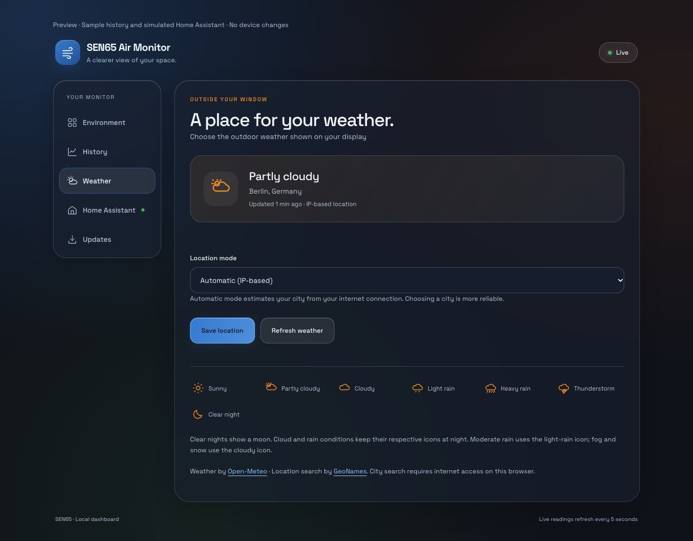
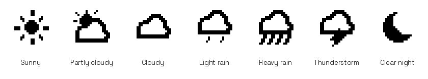

# Weather settings

Available in firmware **v0.3.0**. This feature appears on a physical board only
after installing that firmware; publishing this repository does not update a
board automatically.

## Choose a location

1. Open the board's local dashboard using its hostname or IP address.
2. Select **Weather**.
3. Set **Location mode** to **Choose a city**.
4. Enter a city name or postal code, then press **Search**.
5. Select the correct city, region and country from **Matching locations**.
6. Press **Save location**.

The board stores the selected coordinates and location label in flash.
Settings survive a reboot, but a factory reset removes them. Each board keeps
its own setting. The display clock's timezone is configured separately in
the firmware; changing the weather city does not change the clock.

Select **Automatic (IP-based)** and save to return to the existing approximate
public-IP location lookup. Manual mode skips this lookup and is useful when
your ISP, VPN or mobile connection identifies the wrong city.

The following screenshot is a **browser test preview with sample conditions**,
not live weather or a screenshot from a flashed board. Berlin is an example
search result, not the owner's location. Device-specific connection details
are not shown.



## Refresh and status

- Weather is requested 10 seconds after Wi-Fi connects, after a location is
  saved, and every 15 minutes while Wi-Fi is connected.
- **Refresh weather** requests an extra update, limited to once per 30 seconds.
- The dashboard shows the active location, condition, last-update age,
  in-progress status and errors. A result older than 20 minutes is marked stale.
- A failed update retains the last valid icon. A different city clears the
  previous city's icon until the first valid response for the new city arrives.
- The icon appears on the next overview refresh, normally within about five
  seconds after a successful request, plus the panel's physical refresh time.

## Icon mapping



| Display icon | Open-Meteo WMO codes |
| --- | --- |
| Sun | 0, 1 during daytime |
| Clear-night moon | 0, 1 at night |
| Partly cloudy | 2 |
| Cloudy | 3; fog 45, 48; snow 71, 73, 75, 77, 85, 86 as fallback |
| Light rain | Drizzle 51, 53, 55, 56, 57; slight/moderate rain 61, 63, 66; showers 80, 81 |
| Heavy rain | 65, 67, 82 |
| Thunderstorm | 95, 96, 97, 99 |

Cloud and rain conditions retain their corresponding icons at night; the moon
is reserved for clear/mainly-clear nights. Moderate rain is grouped into the
light-rain icon because this set has only two rain symbols. Unknown or malformed
weather codes are rejected instead of displaying a misleading clear-sky icon.

The mapping follows [Open-Meteo's weather-code documentation](https://open-meteo.com/en/docs).
City search uses the [Open-Meteo geocoding API](https://open-meteo.com/en/docs/geocoding-api),
with location data from [GeoNames](https://www.geonames.org/).

## Local API

- `GET /api/weather` returns `mode`, `location`, `latitude`, `longitude`,
  `kind`, `condition`, `weather_code`, `age_seconds`, `stale`, `fetching`
  and `error`. Coordinates and age are `null` until available.
- `POST /api/weather` accepts an `application/x-www-form-urlencoded` body:
  `mode=auto`, or `mode=manual` with `name`, `latitude`, and `longitude`.
  The response is successful only after settings have been persisted.
- `POST /api/weather/refresh` queues an extra refresh; repeated requests
  inside 30 seconds or during a running request receive HTTP 429.

Names must contain visible text, be less than 128 UTF-8 bytes, and contain no
control characters. Coordinates must be finite and within latitude ±90° and
longitude ±180°. Invalid settings return HTTP 400 without changing the location.
Unsupported methods return HTTP 405; persistence failure returns HTTP 500.

Example requests (replace the example hostname with your board's hostname):

```bash
curl http://sen65-air-monitor.local/api/weather
curl -X POST http://sen65-air-monitor.local/api/weather \
  --data-urlencode 'mode=manual' \
  --data-urlencode 'name=Berlin, Germany' \
  --data-urlencode 'latitude=52.52' \
  --data-urlencode 'longitude=13.41'
curl -X POST http://sen65-air-monitor.local/api/weather/refresh
```

The location-save response is `{"ok":true}` on success. No authentication is
configured for the local dashboard in the default firmware; restrict access
to a trusted LAN.

## Connectivity and validation

The browser needs internet access for city search. The board needs internet
access for weather updates. Automatic location currently uses `ip-api.com`
over HTTP, so automatic location is approximate and is not authenticated.
From v0.3.1, HTTPS weather requests verify server certificates using ESP32's
ESP-IDF certificate bundle (also with the Arduino framework). v0.3.0 did not
verify these certificates. Use the dashboard only on a trusted local network;
do not expose it directly to the internet.

For v0.3.0, the firmware compilation, weather-code/coordinate/settings unit
tests, seven-icon render/boundary checks, and browser city-search/save/restore
flows were verified. Browser tests used a fixture API; reboot persistence and
live weather still require a test on a flashed physical board.
